# NODE-VUE-MOBA
## 一、管理后台
1. 基于Element UI的后台管理基础界面搭建

1. 创建分类
1. 分类列表
1. 修改分类
1. 删除分类
1. 子分类

1. **通用 CRUD 接口**

1. 装备管理
1. 图片上传 (multer)

1. 英雄管理
1. 编辑英雄 (关联,多选,el-select, multiple)
1. 技能编辑

1. 文章管理
1. 富文本编辑器 (quill)

1. 首页广告管理

1. 管理员账号管理 (bcrypt)
1. 登录页面
1. 登录接口 (jwt,jsonwebtoken)
1. 服务端登录校验
1. 客户端路由限制 (beforeEach, meta)
1. 上传文件的登录校验 (el-upload, headers)

## 二、移动端网站

1. "工具样式"概念和 SASS (SCSS)
1. 样式重置
1. 网站色彩和字体定义 (colors, text)
1. 通用flex布局样式定义 (flex)
1. 常用边距定义 (margin, padding)
1. 主页框架和顶部菜单
1. 首页顶部轮播图片 (vue swiper)
1. 使用精灵图片 (sprite)
1. 使用字体图标 (iconfont)
1. 卡片组件 (card)
1. 列表卡片组件 (list-card, nav, swiper)
1. 首页新闻资讯-数据录入(+后台bug修复)
1. 首页新闻资讯-数据接口
1. 首页新闻资讯-界面展示
1. 首页英雄列表-提取官网数据
1. 首页英雄列表-录入数据
1. 首页英雄列表-界面展示
1. 新闻详情页
1. 新闻详情页-完善
1. 英雄详情页-1-前端准备
1. 英雄详情页-2-后台编辑
1. 英雄详情页-3-前端顶部
1. 英雄详情页-4-完善
   
## 结果展示
### 登录页面
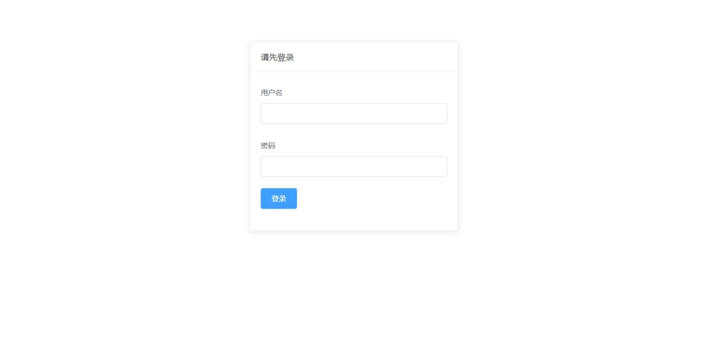
### 分类编辑
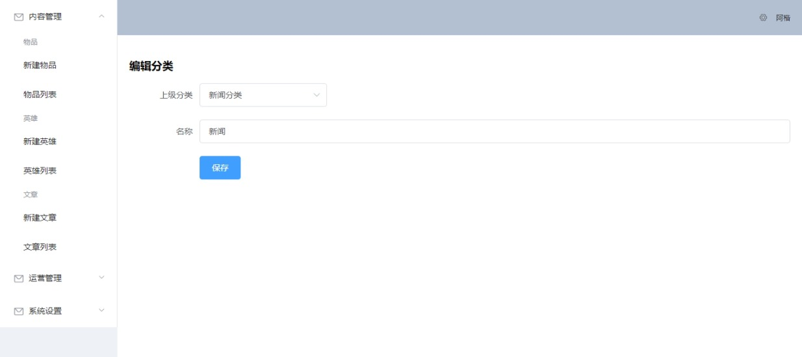
### 分类列表
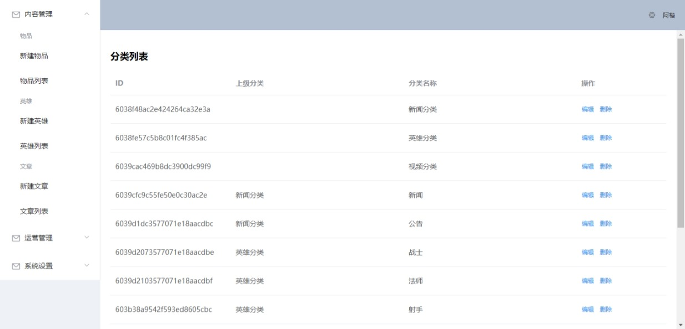
### 管理员编辑
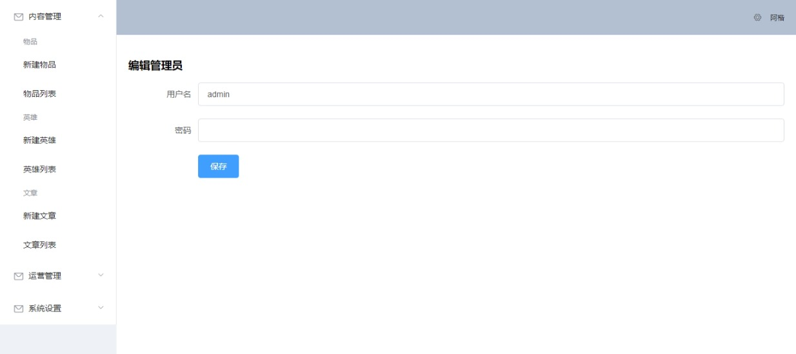
### 管理员列表
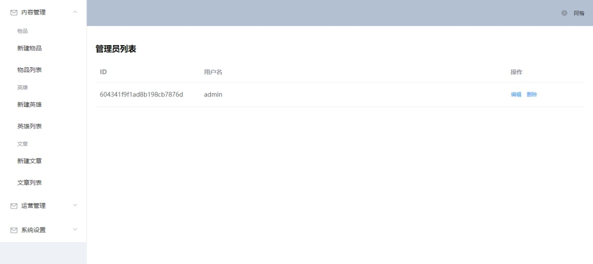
### 广告位编辑
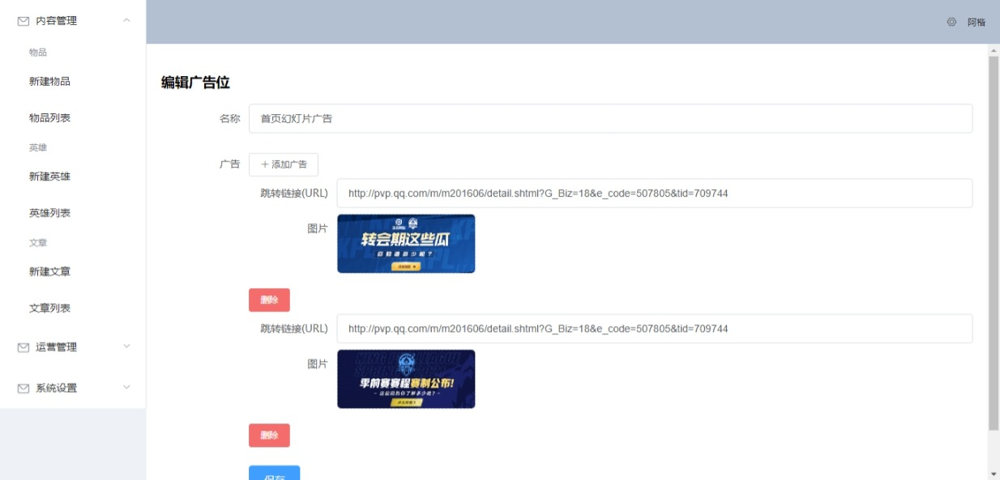
### 广告位列表
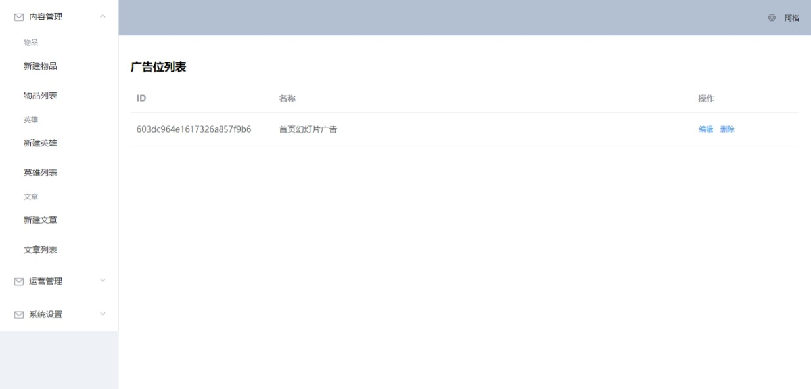
### 文章编辑
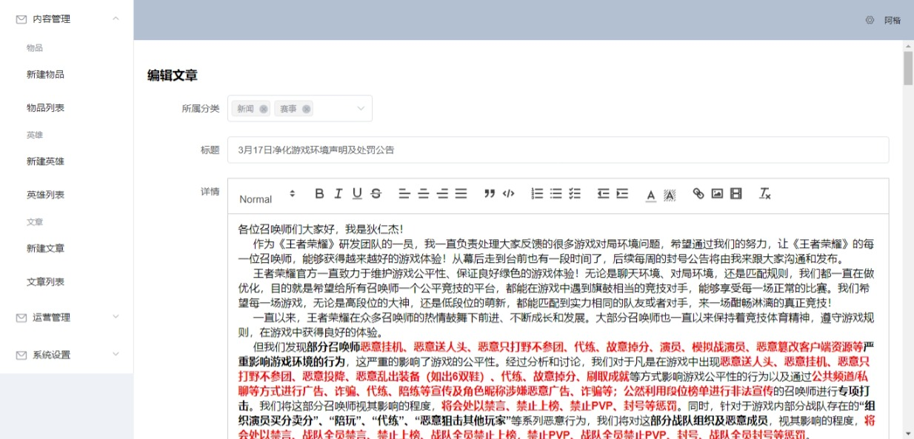
### 文章列表
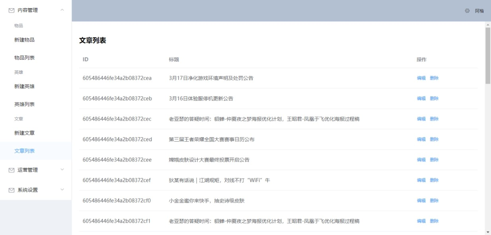
### 物品编辑
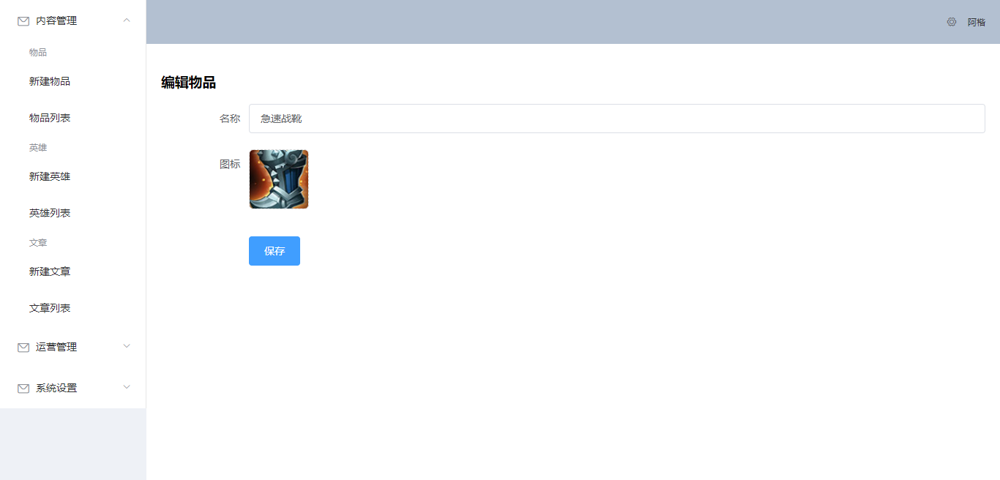
### 物品列表
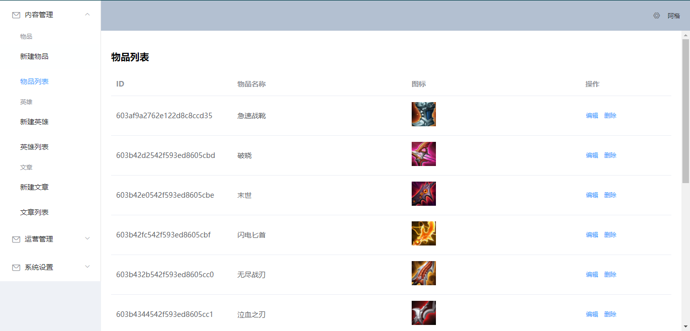
### 英雄编辑
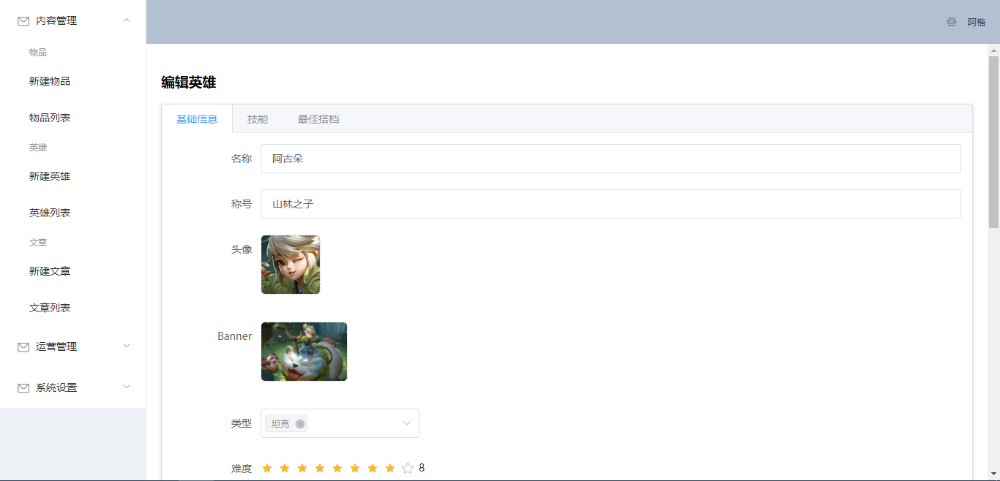
### 英雄列表
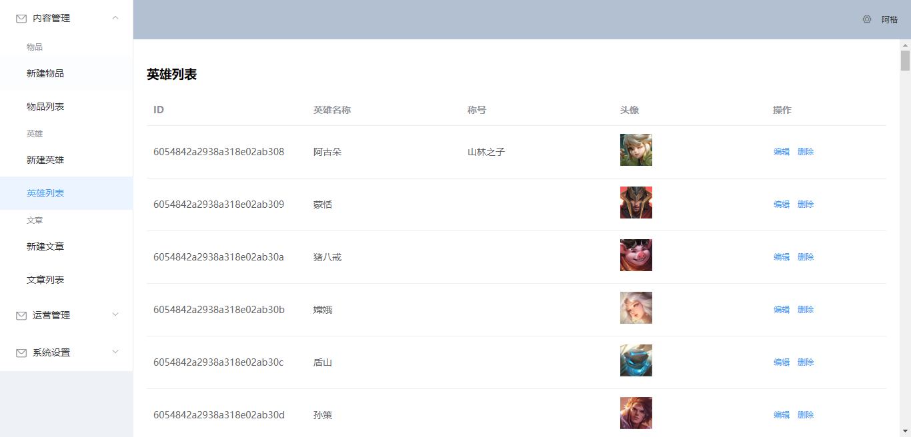
### 前端首页
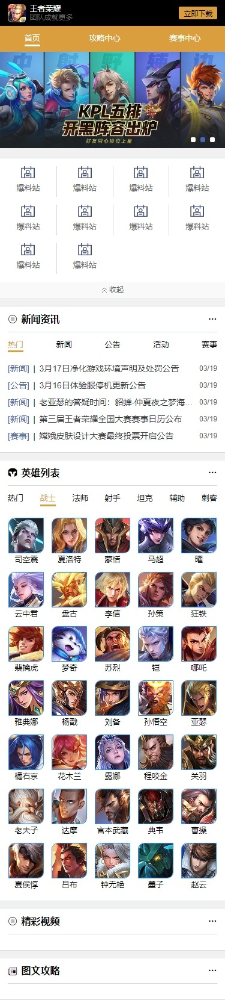
### 文章页面
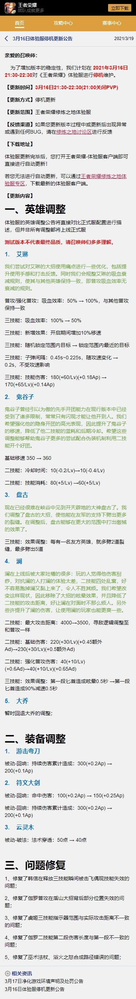
### 英雄页面
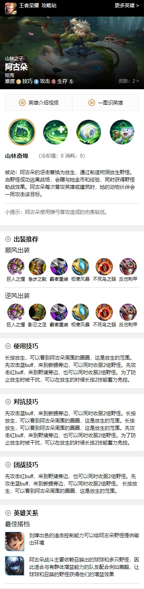
